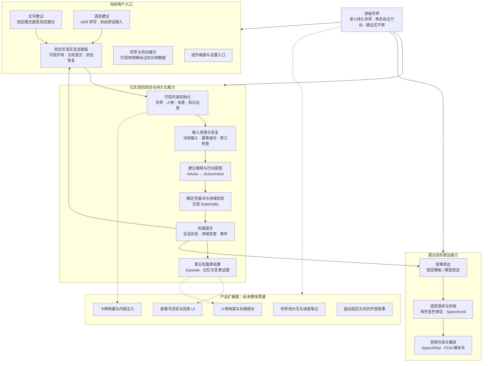
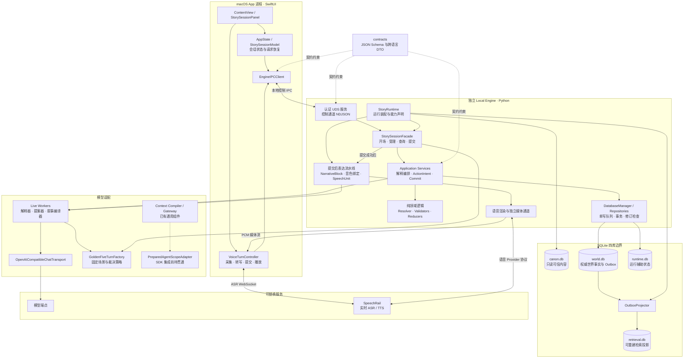
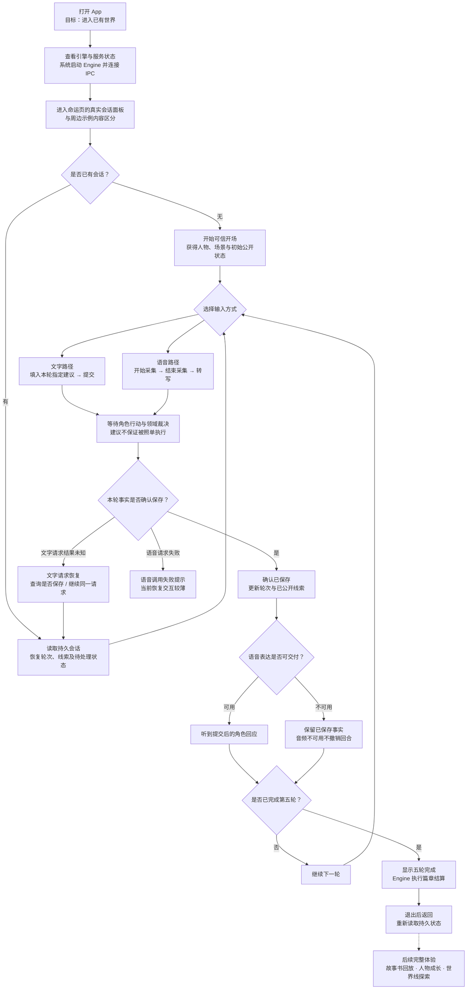
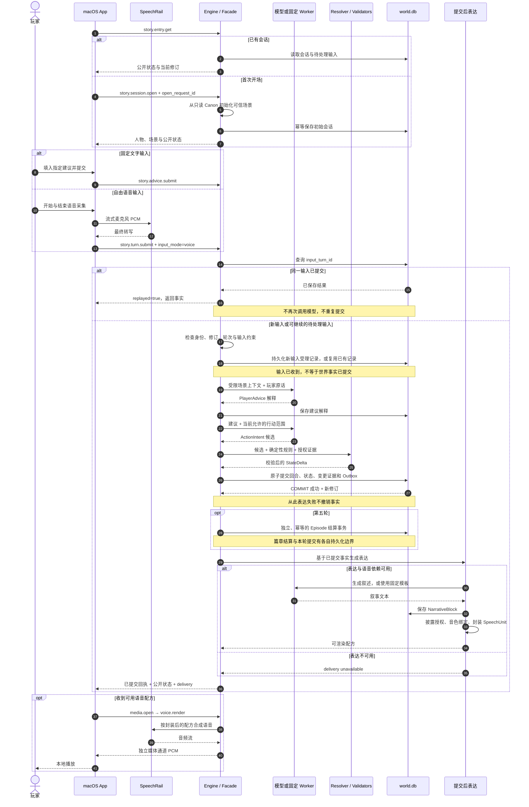

# 项目现状分析与四视图

> **核对日期**：2026-09-28  
> **代码基准**：本地 `main`，`ca68d485a15bacf46ade5e703abde00598ec5251`  
> **文档性质**：实现现状分析快照；不是新 ADR，不替代总体架构基线，不签发验收结论。  
> **分析方法**：核对运行装配、App 入口、输入处理、领域事务、篇章结算与语音链路。图谱索引停留于 2026-09-19，关键路径已通过当前源码补证。  
> **验证边界**：本次未启动模型、语音服务或 App，未重跑测试与运行验收。“已接线”指代码调用关系成立，不等于本次实测成功。

## 1. 项目判断与阅读口径

项目已形成持久化叙事回合的纵向闭环，并接入真实模型与语音调用路径；产品仍处于受限场景 Alpha：真实交互沿用 Golden 五轮规则，完整世界探索、人物管理、故事书与世界线体验尚未全部贯通。

四张图分别回答：

| 视图 | 关注点 |
|---|---|
| 功能架构图 | 用户入口、领域能力和产品扩展面 |
| 技术架构图 | 进程、调用、数据所有权和外部服务边界 |
| 用户旅程图 | 当前真实入口能完成的体验及恢复路径 |
| 端到端流程图 | 输入受理、领域提交、篇章结算与表达交付的先后关系 |

流程图中实线表示当前调用或组成关系，虚线表示规划能力、契约约束或尚未贯通的集成关系，具体含义以边标签及正文为准。序列图的虚线箭头表示返回消息，不表示规划状态。

需要区分三个证据层次：

1. **当前源码事实**：本快照基准下的入口、装配与调用关系。
2. **历史运行证据**：验收记录仅证明其绑定版本、场景与环境。
3. **架构目标与推断**：目标能力和后续关注点不能视为已经实现或验收。

## 2. 功能架构图

### 2.1 当前能力的实际边界

**自由表达已经接入，开放行动空间仍受限。** 真实模型负责理解原话、提出行动和生成表达，但 `LiveFirstTurnFactory` 继续复用 Golden 的最大轮数与裁决策略，不能据此宣称已实现无限开放世界。

人物、故事书、卡牌、世界线和调查笔记在导航中明确标记为规划模块。世界与命运展示仍含示例数据，真实会话面板与示例页面共存；不能把整页的视觉完成度等同于领域数据接入完成度。

卡牌正典内容继续由关联仓库 [hrygo/lotm-card-art](https://github.com/hrygo/lotm-card-art) 维护，本仓库仅在内容注入边界单向消费，不形成第二份事实源。

证据：[导航交付状态](../../macos-app/WorldOfMysteries/Components/AppSidebarView.swift)、[真实模型工厂](../../engine/ai/live_turn_workers.py)、[命运页接线](../../macos-app/WorldOfMysteries/ContentView.swift)。

## 3. 技术架构图

### 3.1 实现与目标架构的区别

- **ASR 与 TTS 路由不同。** App 直接连接 SpeechRail 获取转写；TTS 由 Engine 在提交后授权、封装和渲染，再通过媒体通道交给 App。App 不直连领域数据库。
- **当前真实模型主干没有经过 AgentScope。** 装配使用 `LiveFirstTurnFactory → OpenAICompatibleChatTransport`；AgentScope 文件明确说明它只是 prepared-call 适配接口，尚需真实 SDK 集成验证。依赖锁定并不能证明 SDK 已进入业务主路径。
- **当前 live 上下文受固定场景限制。** Worker 使用从可信 bootstrap 提取的 `_SceneBrief` 和当前允许的行动签名；不能把已有通用 Context Compiler 组件画成当前回合必经的动态世界上下文编译器。
- **检索投影与权威事实分离。** `world.db` 是权威数据，`retrieval.db` 可重建。Outbox 箭头代表投影机制，不表示本次已确认存在持续运行的后台投影任务。
- **能力标志不是外部服务验收凭证。** 配置、运行对象构造、端点可达和真实调用成功属于不同证据层次；界面能力提示不能替代真实模型与音频验收。

证据：[运行装配](../../engine/infrastructure/story_runtime.py)、[语音控制器](../../macos-app/WorldOfMysteries/Media/VoiceTurnController.swift)、[AgentScope 适配边界](../../engine/ai/agentscope_adapter.py)、[上下文编译器](../../engine/application/context_compiler.py)、[数据库管理器](../../engine/infrastructure/database_manager.py)。

## 4. 用户旅程图

按当前真实入口绘制，不给尚未实现的产品体验虚构完成度或满意度。

### 4.1 体验断点

1. **输入入口不统一。** 命运页内真实面板已经能提交，底部常驻建议台仍禁用，用户可能把两个区域误认为同一能力。
2. **模式说明与能力不完全一致。** 面板仍写着“固定模式”，语音能提交自由原话；实际约束是“输入可自由、行动规则仍固定”。
3. **文字与语音恢复体验不对称。** 文字路径有冻结请求、查询和同一请求重试；语音控制器主要呈现失败状态，不能推定它已具备同等完整的恢复交互。
4. **事实保存与可听反馈应分开理解。** 音频失败不代表建议没有改变世界。反过来，第五轮 UI 完成也不能单独证明篇章结算的全部产物落盘。

以上为源码支持的交互分析，尚非用户测试结果。图中语音分支以所需模型、ASR 与渲染能力可用为前提。

证据：[会话面板](../../macos-app/WorldOfMysteries/StorySessionPanel.swift)、[文字请求恢复](../../macos-app/WorldOfMysteries/StorySessionModel.swift)、[语音请求控制](../../macos-app/WorldOfMysteries/Media/VoiceTurnController.swift)、[命运页](../../macos-app/WorldOfMysteries/ContentView.swift)。

## 5. 端到端流程图

### 5.1 事务与失败边界

流程图突出领域提交与表达边界，未展开每个内部函数。固定路径的 `FiveTurnSettlement` 可在篇章结算前发布固定 `BeatPlan` / `NarrativeBlock`；live 路径关闭该固定表达写入，转由提交后 delivery 生成表达，避免两条路径写同一叙事槽位。因此不能把图中的聚合“提交后表达”步骤理解为所有模式中唯一的叙事写入位置。

必须区分三个状态：**输入已受理、领域事实已提交、表达已交付**。

| 边界 | 已持久化的内容 | 失败与恢复含义 |
|---|---|---|
| 输入受理后、领域提交前 | 原始输入身份及受理记录；解释可另行保存 | 待处理输入不代表世界已变化；继续请求须保持同一身份及冻结内容 |
| 回合 COMMIT 后 | 回合、状态增量、领域变更证据、事件及修订 | 返回丢失时查询已提交结果，不能重新裁决或重复写事实 |
| 篇章结算 | Episode 与关联结算产物 | 独立于回合事务；结算失败不撤销已提交回合 |
| 表达交付 | 叙事及后续语音产物 | 合成、播放或 UI 失败不得反向改写世界事实 |

服务端具备幂等边界，不等于每种客户端都已完成对应恢复 UI；重发已提交输入也不等于自动重建缺失的全部表达产物。

证据：[会话编排](../../engine/application/story_session_facade.py)、[裁决与提交](../../engine/application/advice_commit.py)、[回合持久化](../../engine/infrastructure/story_session_repository.py)、[篇章结算](../../engine/infrastructure/episode_settlement.py)、[提交后 delivery](../../engine/infrastructure/story_runtime.py)、[公开控制方法](../../engine/infrastructure/story_control.py)。

## 6. 工程判断与后续关注点

以下为基于当前实现的分析判断，不是已批准的新迭代计划。

领域持久化与恢复机制的实现完整度已高于产品表面的统一程度。后续应重点核对：

1. **真实入口统一**：将实际会话、输入、能力状态和示例页面边界统一到用户能理解的主流程。
2. **动态授权上下文**：从固定 bootstrap 的场景摘要扩展到由当前世界、角色知识、记忆与修订共同驱动的授权上下文。
3. **行动空间扩展**：将自由语言输入与开放世界规则扩展分别验收，避免把接入 LLM 等同于实现开放世界。
4. **恢复与表达补偿**：补齐语音请求身份保留、结果未知时查询及缺失表达的明确恢复入口。
5. **持久结果可见性**：贯通 Episode、人物记忆与故事书读取体验，使已保存事实能够被用户查阅。
6. **目标架构集成**：按实际价值推进 AgentScope 与通用 Context Compiler / Gateway 接线；每一步用真实调用证据确认。

## 7. 历史证据、状态差异与维护规则

前序只读分析时，`PROJECT_STATE.json` 摘要记录固定五轮完成，而里程碑表仍保留部分较早的阻塞状态；代码基准已包含后续语音接线。落盘时该状态文件存在其他未提交改动，本次未修改它。此处记录的是分析时发现的差异，不替代状态文件后续维护结果。

[2026-09-27 Golden 五轮 GUI 观察记录](../06_实施基线/2026-09-27_Golden_Five_Turn_GUI_Observation_Record.md)绑定 `f72f379`，记录了打包 App 的固定五轮操作、磁盘事实和相关恢复证据。它不能直接证明本快照版本的真实模型与语音运行成功。

相关规范与事实源：

- [总体架构基线](总体架构基线_v1.0.md)
- [AgentScope AI Runtime ADR](ADR-003_AgentScope_AI_Runtime.md)
- [Persistent World Alpha 推进与验收计划](../06_实施基线/Persistent_World_Alpha_Plan_v1.0.md)
- [项目状态](../PROJECT_STATE.json)
- [文档总入口](../README.md)

后续改变运行装配、输入入口、事务边界或开放场景范围时，应复核对应图示及证据链接，并更新代码基准。历史验收日期和绑定版本应保留；新一次成功验证应另附其证据，不将历史记录改写为当前实测。
