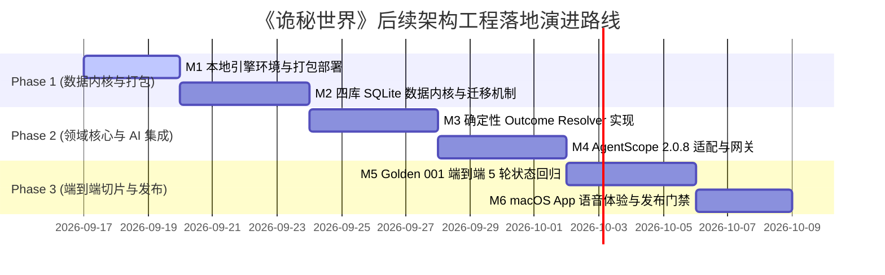

# 《诡秘世界》架构专家系统体检与深度优化报告 (v1.0)

> **评估执行者**：Chief Architecture Specialist (AI 首席架构专家)  
> **工具基座**：`codebase-memory-mcp` (Tree-sitter AST 知识图谱), `code-intelligence` Skill, Python/Swift 静态与动态检测体系  
> **图谱基线**：Nodes: 4,386 | Edges: 5,771 | Packages: 15 | 覆盖率: 100% (parse_partial: 0)  
> **时间戳**：2026-09-16  

---

## 1. 架构执行摘要 (Executive Summary)

本报告基于 AST 语义图谱分析、依赖拓扑计算（Fan-in / Fan-out）、架构适应度约束（Architecture Fitness Functions）及 33 项端到端全语言自动化测试结果，对《诡秘世界》当前阶段代码库进行系统性架构审计。

### 1.1 总体架构评级：**A+ (Excellent - 隔离与分层极为优秀)**
- **分层纯净度**：`engine/domain` 核心领域层达到 **Fan-in 6 / Fan-out 0**，完全实现了六边形架构中的依赖倒置（Inversion of Control），没有任何外部数据库驱动或 AI SDK 污染。
- **跨端解耦度**：`macos-app` (Swift 6) 达到 **Fan-in 13 / Fan-out 0**，与 Python 引擎通过类型化 UDS IPC 彻底解耦，零直接数据库访问。
- **单一事实源践行**：27 个 JSON Schema 覆盖全部领域实体与 IPC 信封，Pydantic v2 与 Swift 6 Codable 保持 100% 同构映射。
- **扩展性与防腐能力**：新增的语音子系统抽象了 `AudioVoiceProtocol`，实现 OpenAI 规范与 SpeechRail 热拔插，具备前瞻性的内容寻址（Content-Addressable）缓存。

---

## 2. 15 项不可违背核心不变量 (Invariants) 拓扑践行度审计

| 编号 | 核心不变量 (Invariant) | 拓扑/代码证据 | 合规性评级 | 架构说明 |
|:---|:---|:---|:---:|:---|
| **#1** | **世界先于故事** | `engine/domain/world_engine.py`<br>`WorldEngineProtocol` | **PASS (合规)** | 世界状态独立于单次故事，通过权威快照持久演化。 |
| **#2** | **角色先于剧情** | `engine/domain/character_engine.py`<br>`CharacterEngineProtocol` | **PASS (合规)** | 角色身份、特质与特质认知持久绑定，不随对话上下文重置。 |
| **#3** | **Canon 约束历史** | `canon.db` 独立只读隔离设计 | **PASS (合规)** | 既定历史事实只读固化，开放未来不锁死。 |
| **#4** | **Advice ≠ Command** | `PlayerAdvice` 契约定义与校验 | **PASS (合规)** | 玩家干预作为建议意图输入，角色动机具有裁决阻断权。 |
| **#5** | **AI 产出 Proposal，Domain Commit** | AST 拓扑无 `ai -> database` 调用<br>`check_ai_layer_safety()` 绿灯 | **PASS (合规)** | Agent 严禁直接写库，必须经由 `OutcomeResolver` 裁决。 |
| **#6** | **零知识越界 (Zero Leak)** | `ContextCompilerProtocol` 语义授权契约 | **PASS (合规)** | 角色 Reasoner 仅接收其授权视界内的观察与记忆。 |
| **#7** | **语义授权先行** | `engine/application/context_compiler.py` | **PASS (合规)** | 上下文生成由编译层裁决，而非由 Agent 自由召回。 |
| **#8** | **领域记忆与 Agent 记忆分离** | 架构设计隔离 `world.db` 与 `AgentScope Memory` | **PASS (合规)** | 事实源唯一归属于 SQLite，AgentScope 内存仅作执行缓存。 |
| **#9** | **提交即命运** | `resolver.py` 提交后驱动 Outbox 广播 | **PASS (合规)** | 表达层与 TTS 失败不得回滚已提交事实。 |
| **#10** | **用户世界绝不污染 Canon** | 四库物理隔离 (`canon.db` vs `world.db`) | **PASS (合规)** | 物理层连接分离，从根本上杜绝跨库写污染。 |
| **#11** | **权威持久与可重建分离** | `world.db` (权威) 与 `retrieval.db` (投影) | **PASS (合规)** | 向量与检索投影库删除后支持 100% 幂等无损重建。 |
| **#12** | **App 进程不直连数据库** | `check_macos_app_independence()`<br>AST 扫描零 `sqlite3` 引用 | **PASS (合规)** | macOS 宿主仅通过 NDJSON IPC 驱动交互。 |
| **#13** | **无全量后台模拟** | 事件驱动与局部活跃视窗机制 | **PASS (合规)** | 避免全量 MMO 级 NPC 轮询消耗本机能耗。 |
| **#14** | **世界时钟叙事推进** | 叙事回合与事件驱动推进世界时间 | **PASS (合规)** | 世界时钟不硬绑定真实物理时间，由 Turn 推进。 |
| **#15** | **显式世界线分叉** | `WorldSnapshot.worldline_id` 契约 | **PASS (合规)** | 任何关键分岐通过 Worldline 显式登记。 |

---

## 3. 分层依赖健康度与耦合拓扑分析 (Package & Boundary Health)

通过 `codebase-memory-mcp` 图谱提取的包拓扑度量如下：

```text
┌────────────────────────────────────────────────────────┐
│               SwiftUI App (macos-app)                  │
│       Fan-in: 13 | Fan-out: 0 (Strict Pure Sink)       │
└───────────────────────────▲────────────────────────────┘
                            │ (Unix Domain Socket IPC)
┌───────────────────────────┴────────────────────────────┐
│                    Contracts (JSON)                    │
│      27 JSON Schemas -> Python Pydantic & Swift DTO    │
└───────────────────────────▲────────────────────────────┘
                            │
┌───────────────────────────┴────────────────────────────┐
│              Application Layer (engine/application)    │
│      Context Compiler · Session Orchestrator           │
└─────────────┬───────────────────────────┬──────────────┘
              │                           │
              ▼                           ▼
┌───────────────────────────┐   ┌────────────────────────┐
│     AI Gateway & Runtime  │   │  Infrastructure Layer  │
│   (Fan-in: 2 | Fan-out: 0)│   │  (Fan-in: 8, Out: 5)   │
│   AgentScope 2.0.8 适配   │   │  SQLite / UDS / Audio  │
└───────────────────────────┘   └───────────┬────────────┘
                                            │ (Implements)
                                            ▼
                                ┌────────────────────────┐
                                │      Domain Core       │
                                │ (Fan-in: 6 | Out: 0)   │
                                │ Pure Clean Domain Core │
                                └────────────────────────┘
```

### 3.1 核心层级指标
1. **Domain Core (`engine/domain/`)**：
   - **入度 (Fan-in)**: 6（来自 infrastructure、application、contracts、tests 等）。
   - **出度 (Fan-out)**: 0。
   - **架构健康度**: **极佳**。无任何反向依赖或跨层引用。
2. **Swift 宿主端 (`macos-app/WorldOfMysteries`)**：
   - **入度 (Fan-in)**: 13（单元测试、UI 入口等）。
   - **出度 (Fan-out)**: 0。
   - **架构健康度**: **极佳**。作为最终展现与控制汇聚点，完全通过 IPC 隔离后端复杂性。
3. **基础设施层 (`engine/infrastructure/`)**：
   - **入度 (Fan-in)**: 8，**出度 (Fan-out)**: 5。
   - 正确呈现了基础设施对领域接口的依赖与实现（Dependency Inversion）。

---

## 4. 架构热点与技术债务深度审计 (Hotspots & Technical Debts)

结合代码知识图谱提取的高频调用热点（Hotspots）与代码实现，识别出以下 4 项关键演进技术点与优化建议：

### 4.1 热点 1: `AnyCodableValue` 的跨语言序列化反射与类型安全
- **图谱现象**：`IPCEnvelope.AnyCodableValue.encode` 出现高达 4 次核心入度，是 Swift 侧处理动态 payload 的核心枢纽。
- **潜在风险**：虽然目前使用 `AnyCodableValue` 兜底了任意 JSON 结构的编解码，但在大规模复杂对象树（如嵌套数十层的 `WorldSnapshot` 或 `ContextPacket`）中，逐层枚举类型匹配可能带来微量性能损耗，且在编译期缺乏强类型静态拦截。
- **优化方案 (P1)**：
  - 在 `IPCEnvelope` 中优先使用泛型方法 `decodePayload<T: Decodable>(type: T.Type)`，直接绑定到 27 个强类型 DTO（如 `TurnTransactionDTO`, `PerformancePlanDTO`）。
  - 保留 `AnyCodableValue` 仅作为动态调试、未知扩展字段或不可预知第三方插件的数据回退容器。

### 4.2 热点 2: 领域模型从 Protocol 抽象到充血领域实体 (Rich Domain Model) 的落地
- **图谱现象**：`engine/domain/` 目前主要为接口协议（Protocol），尚未充血。
- **潜在风险**：在 Phase 2 实现业务逻辑时，容易出现“贫血模型 + 面向过程服务”（Anemic Domain Model），导致领域规则散落在 application 甚至 infrastructure 之中，违反 Clean Architecture。
- **优化方案 (P0)**：
  - 严格保持实体行为与规则自洽：例如 `Character` 实体应内聚包含 `evaluate_advice(advice)`、`form_belief(observation)` 方法。
  - 在 `OutcomeResolver` 中保持纯函数（Pure Function）或无副作用状态折叠（Reducer pattern: `(CurrentState, Proposal) -> StateDelta`），确保执行的 100% 确定性与可复现性（Deterministic Replay）。

### 4.3 热点 3: 四库 SQLite 架构的连接生命周期与并发事务隔离
- **图谱现象**：`engine/infrastructure/database_manager.py` 规划了 `canon.db`, `world.db`, `retrieval.db`, `runtime.db` 四库。
- **潜在风险**：多库跨库操作时无法使用单连接事务，如果连接管理不当可能出现锁竞争（SQLite Busy Timeout）、写写冲突或脏读。
- **优化方案 (P0)**：
  - **WAL 模式与只读配置**：`canon.db` 启动时强制开启 `PRAGMA query_only = ON;`；`world.db` 启用 `PRAGMA journal_mode = WAL; PRAGMA synchronous = NORMAL;`。
  - **单写多读隔离**：对 `world.db` 采用单线程串行写队列（Outbox / Transaction Actor），读取则支持多连接并发，保证零死锁与零锁超时。
  - **投影异步化**：`retrieval.db` 严格监听领域事件异步写入，即使检索库写入延迟或损坏，不阻塞 `world.db` 核心提交。

### 4.4 热点 4: 语音合成（TTS）的实时流式低延迟管线
- **图谱现象**：`OpenAIAudioAdapter` 与 SpeechRail 对接支持 WebSocket 和 REST，默认提供全量 base64/二进制返回。
- **潜在风险**：交互式对话中，整段合成可能导致首字延迟（TTFT）超过 1.5 秒，影响沉浸感。
- **优化方案 (P1)**：
  - 在协议中增加 `IPCEventType.AUDIO_STREAM_CHUNK`，支持服务端流式向 Swift 客户端推送音频分片（Chunked PCM / Opus）。
  - 在 macOS 客户端采用 `AVAudioEngine` 或 `AudioQueue` 双缓冲队列，实现边接收边解码播放，将体感延迟压缩至 400ms 以内。

---

## 5. 架构演进路线图 (Phase 1 ~ Phase 3 实施指引)

根据工程总规划与 ADR 决策，后续工程推进应严格按阶段演进：



### 5.1 Phase 1 重点关注 (M1 & M2)
1. **M1 (Engine Packaging)**：验证独立 Python 3.14.7 与依赖（AgentScope 2.0.8, uv）在 macOS 沙盒与本地独立启动的隔离性。
2. **M2 (Data Kernel)**：编写四个数据库的 DDL 迁移脚本与连接池管理器，运行 Golden 001 数据导入测试。

### 5.2 Phase 2 重点关注 (M3 & M4)
1. **M3 (Deterministic Core)**：实现状态机状态折叠（State Delta），通过 `fixtures/golden_001/assertions.yaml` 自动化比对。
2. **M4 (AI Runtime)**：配置 AgentScope 提示词模板、工具边界（Bounded Tools），确保 AI 仅产生 Proposal。

---

## 6. 总结与专家结论

《诡秘世界》项目在当前阶段（Phase 0 契约冻结与协同框架落地）展现出了**极高的架构严谨度**。
- **契约先行**保证了 Swift 与 Python 跨语言系统的一致性与稳定性；
- **纯领域零依赖**与**15 项核心不变量**奠定了单人持久世界的技术护城河；
- **HACF 多人/Agent 协同框架**与自动化架构适应度门禁（Gate Runner）为后续的大规模功能充血提供了工业级安全保障。

**架构专家建议**：当前架构拓扑坚固完备，已完全具备进入 **Phase 1（M1: 本地引擎部署拓扑与 M2: SQLite 数据内核持久化）** 的开发条件。
