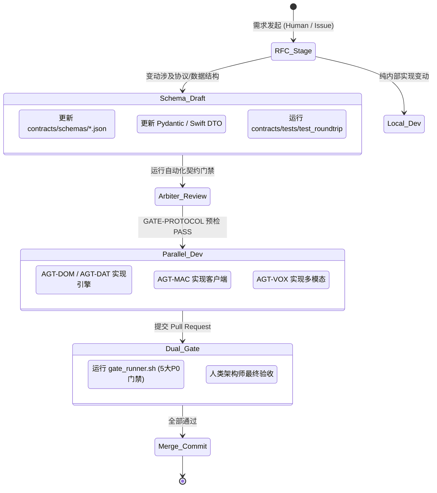

# 《诡秘世界》人机与多 Agent 协同研发工作框架 v1.0
(Human-Agent Collaborative Development Framework - HACF)

> **版本**：v1.0  
> **适用环境**：Apple Silicon macOS (arm64), Python 3.14.7 + Swift 6.4, RTK, codebase-memory-mcp  
> **核心原则**：契约唯一源头、架构不变量守卫、角色专精隔离、无锁并行协同、硬门禁双循环审查

---

## 1. 框架设计愿景与背景痛点

在《诡秘世界》这种高严谨度、双语言栈（SwiftUI + Python）、强事务持久化（SQLite 核心）且重度依赖 AI 叙事的持久世界项目中，无论是多个人类工程师、人类与 AI Agent，还是多个 Agent 协同开发，都会面临以下典型困境：

1. **协议与类型漂移（Contract Drift）**：一端修改了业务模型，另一端未同步，导致运行时序列化崩溃；
2. **架构越界污染（Boundary Contamination）**：开发 AI 的 Agent 悄悄在领域层调用数据库，或客户端直接侵入底层；
3. **上下文爆炸与遗忘（Context Saturation）**：Agent 多轮对话后盲目修改无关代码，制造难以排查的隐蔽回归；
4. **Git 并发代码合并地狱（Merge Conflicts）**：多个主体并行修改同一组文件，产生大量冲突；
5. **口头约束失效（Lack of Machine Enforceability）**：15 项不变量只停留在文字，缺乏自动化工具强制拦截。

本框架结合**业界顶级协同研发实践（Spec-First、Actor-based Agent Specialization、Fitness Functions、Git Worktrees）**，并深度贴合**本机软硬件环境（Apple Silicon M系列统一内存、RTK 输出优化、codebase-memory-mcp 图谱拓扑、uv/Swift 极速工具链）**，打造一套可持续自演进的高效协同研发体系。

---

## 2. 核心协同架构总览 (The 5 Pillars)

```text
                  ┌──────────────────────────────────────────────┐
                  │          Human Overseer / Architect          │
                  │   (意图设定 · 重大决策裁决 · 最终合并批准)      │
                  └──────────────────────┬───────────────────────┘
                                         │
                                         ▼
┌─────────────────────────────────────────────────────────────────────────────────┐
│                      Pillar 1: 角色专精拓扑 (Specialized Agents)                 │
│  Arbiter (契约门禁) · Domain (领域纯逻辑) · Data (强事务) · AI (网关隔离)        │
│  Voice (语音多模态) · macOS (SwiftUI平台) · Inquisitor (质量与混沌测试)          │
└────────────────────────────────────────┬────────────────────────────────────────┘
                                         │
                 ┌───────────────────────┴───────────────────────┐
                 ▼                                               ▼
┌──────────────────────────────────┐            ┌──────────────────────────────────┐
│ Pillar 2: 契约先行流水线         │            │ Pillar 3: 本机无冲突并发机制     │
│ (Contract-First Pipeline)        │            │ (Worktree & Path Locks)          │
│ Schema RFC → Roundtrip Gate      │            │ Git Worktree 物理目录隔离        │
│ → 并行实现 → 最终 Commit         │            │ 严格文件属主（Ownership Matrix） │
└────────────────┬─────────────────┘            └────────────────┬─────────────────┘
                 │                                               │
                 └───────────────────────┬───────────────────────┘
                                         ▼
┌─────────────────────────────────────────────────────────────────────────────────┐
│            Pillar 4: 基于代码知识图谱的共享黑板 (Graph-Informed Memory)         │
│  codebase-memory-mcp: 符号索引 · trace_path 调用链 · detect_changes 影响分析    │
└────────────────────────────────────────┬────────────────────────────────────────┘
                                         │
                                         ▼
┌─────────────────────────────────────────────────────────────────────────────────┐
│                 Pillar 5: 自动化适应度函数与硬门禁 (Dual-Loop Gates)             │
│  L1 本地拦截 (Import Linter + RTK Fast Tests) → L2 CI/Gate-Runner (P0 Gates)    │
└─────────────────────────────────────────────────────────────────────────────────┘
```

---

## 3. Pillar 1: 角色专精拓扑与 RACI 矩阵

禁止“全能型 Agent”处理全栈跨层代码。依据项目目录规范与 Ownership 边界，设立 7 大专精角色：

### 3.1 角色定义与能力职责

| 角色代码 | 角色名称 | 核心职责 | 允许修改路径 | 严格禁止行为 |
|---|---|---|---|---|
| **HUMAN** | **人类总架构师** | 产品方向、重大分叉审批、发布授权、意图裁决 | 全部 | 盲目跳过门禁强推主干 |
| **AGT-ARB** | **Arbiter Agent (契约守护)** | 守护 15 项不变量，管理 JSON Schema 演进，运行协议往返一致性测试 | `contracts/`, `.ci/`, `docs/` | 擅自修改具体业务实现 |
| **AGT-DOM** | **Domain Weaver (领域逻辑)** | 领域核心实体、状态推进、Outcome Resolver 确定性裁决、上下文编译 | `engine/domain/` | `import sqlite3/aiosqlite`, `import agentscope`, 调用外部网络 |
| **AGT-DAT** | **Data Keeper (数据持久化)** | `world.db` 强事务、单写队列、Transactional Outbox、`retrieval.db` 重建 | `engine/infrastructure/` (db/outbox) | 绕过 Outbox 直接在业务逻辑写检索库 |
| **AGT-AI** | **Mystic Gateway (AI运行时)** | Mysterious AI Gateway 隔离、AgentScope 绑定、结构化重试、限步熔断 | `engine/ai/` | 为 Agent 挂载具备 DB 写入能力的 Tool |
| **AGT-VOX** | **Voice Bard (语音多模态)** | OpenAI SDK 标准协议适配、SpeechRail 集成、音频资产 Hash 缓存、字幕降级 | `engine/infrastructure/audio/` | 在音频失败时篡改已提交剧情 |
| **AGT-MAC** | **macOS Artisan (客户端)** | SwiftUI 视图与动画、Swift 6 Strict Concurrency、AppState 编排、UDS 客户端 | `macos-app/` | 越过 IPC 直接读取 Engine SQLite 文件 |
| **AGT-QA** | **Inquisitor (质量与混沌)** | Golden Scenario 自动化回归、G001-G012 黄金断言、故障注入与恢复断言 | `fixtures/`, `*/tests/` | 随意篡改黄金断言预期来配合失败测试 |

---

## 4. Pillar 2: 契约先行端到端工作流 (Contract-First Flow)

任何功能研发（无论是跨模块重构还是新增能力）严格遵循 5 步状态机流转：



### 关键控制点：
1. **Schema 冻结先行**：跨端功能未在 `contracts/` 冻结且通过双向序列化测试前，禁止前端/后端提前拉起代码实现。
2. **显式变更声明**：修改 Schema 必须注明向后兼容性（Backward Compatibility），禁止随意删除既有字段破坏向前兼容。

---

## 5. Pillar 3: 本机无冲突并发机制 (Worktree & Path Locks)

针对单台 Mac 机器上可能同时运行多个并行 Agent 或人类工程师的场景，设计无锁、无冲突的隔离研发环境：

### 5.1 基于 Git Worktree 的物理目录隔离
利用 Git 2.5+ 原生支持的 `worktree` 能力，为并行研发任务分配独立的物理目录，避免工作区被互相覆盖：

```bash
# 创建专职任务工作树（例如进行 Phase 1 的数据内核攻关）
git worktree add -b feat/data-kernel ../wom-data-kernel main

# 完成并合并后安全清理
git worktree remove ../wom-data-kernel
```

### 5.2 路径所有权锁（Path Ownership Matrix）
在合并前，PR 检查脚本校验每个 Agent 的改动范围是否超出其角色授权路径（如 `AGT-DOM` 的 commit 绝不能包含 `macos-app/` 文件的修改），一旦越界自动打回重做。

---

## 6. Pillar 4: 基于代码知识图谱的共享黑板 (Graph-Informed Memory)

为了防止多 Agent 协作时产生“盲人摸象”或大文件上下文导致 Token 耗尽，全面接入系统已挂载的 **`codebase-memory-mcp`**：

### 6.1 核心调用契约与场景
1. **任务分发前拓扑审计 (Pre-Dispatch Impact Analysis)**：
   - 当人类或 Arbiter 准备修改一个核心符号（如 `Character` 或 `EngineIPCEnvelope`）时，先调用：
     ```json
     call_mcp_tool(ServerName="codebase-memory-mcp", ToolName="trace_path", Arguments={"project": "Users-hrygo-Documents-WorldofMysteries", "function_name": "Character", "direction": "both"})
     ```
   - 快速查明该符号的上下游所有调用者，将拓扑证据直接作为任务上下文分发，杜绝 Agent 盲目全局搜索。
2. **精准符号读取 (AST Snippets over Full Files)**：
   - 严禁对大文件（超过 300 行）全量调用 `view_file`，优先调用：
     ```json
     call_mcp_tool(ServerName="codebase-memory-mcp", ToolName="get_code_snippet", Arguments={"project": "Users-hrygo-Documents-WorldofMysteries", "qualified_name": "<CLASS_OR_FUNC>"})
     ```
3. **提交前影响范围验证 (Git Diff Impact)**：
   - 每次提交前调用 `detect_changes`，毫秒级分析分支变更波及的模块，确保修改没有击穿隔离边界。

---

## 7. Pillar 5: 自动化适应度函数与硬门禁流水线 (Fitness Functions & Gates)

任何协同框架必须依靠**不可动摇的机器检查**。我们建立双循环（Dual-Loop）防护网：

### 7.1 L1: 本地极速自愈循环 (Local Fast Feedback)
结合本机 **RTK** 优化工具，以极低 Token 消耗执行本地高频验证：
- **代码规范与格式化**：`rtk ruff check .` / `rtk swiftlint`
- **契约与模型测试**：`rtk uv run pytest tests/test_contracts_pydantic.py` (0.1s 极速反馈)
- **客户端核心测试**：`rtk swift test` (0.001s 极速反馈)

### 7.2 L2: 架构适应度检查脚本 (`scripts/check_architecture_fitness.py`)
使用静态分析脚本强制校验 15 项不变量：
1. **边界检查 1**：扫描 `engine/domain/` 下的所有 `.py` 文件，若发现 `import sqlite3`、`import aiosqlite` 或 `import agentscope`，直接阻断构建；
2. **边界检查 2**：扫描 `macos-app/` 下的所有 `.swift` 文件，若发现直接读写 SQLite 文件，直接阻断构建；
3. **边界检查 3**：扫描 `engine/ai/` 下的工具类，若存在向领域数据库执行 `INSERT/UPDATE/DELETE` 的 Tool，直接阻断构建。

### 7.3 L3: 受保护门禁执行器 (`scripts/gate_runner.sh`)
> ⚠️ **HACF 2.1 修订**：门禁命令已移入受保护档案 `.hacf/gates/*.json`（摘要记录于 `registry.json`），
> `gate_runner.sh` 退化为薄封装。`--all-p0` 等旧参数已废弃并自动回退为 `FULL_P0`。

将 `Go_NoGo_Gates_v1.0.yaml` 中定义的 P0 门禁固化为按档案执行的一键脚本：

```bash
bash scripts/gate_runner.sh              # 默认 FULL_P0（全量三阶段）
bash scripts/gate_runner.sh DOMAIN_P0    # 角色专精档案
```
- `GATE-PACKAGE`: 校验独立打包与 UDS 握手就绪
- `GATE-PROTOCOL`: 校验 Schema metaschema 与 Swift/Python 往返一致性
- `GATE-DATA`: 校验 SQLite STRICT/WAL/FULL 与故障恢复能力
- `GATE-AI`: 校验 Gateway 隔离与 Proposal 结构化重试
- `GATE-GOLDEN-MOCK`: 校验 Golden 001 Mock 5 轮全通与 G001-G012 断言

---

## 8. 实施落地方案与即刻演进建议

为使本协同框架不仅停留在规范层面，我们在近期工程迭代中落地以下配套工程设施：

1. **落成架构适应度脚本**：编写 [`scripts/check_architecture_fitness.py`](../../scripts/check_architecture_fitness.py)，纳为每次 commit/push 的必跑前置检查；
2. **完善统一门禁脚本**：编写 [`scripts/gate_runner.sh`](../../scripts/gate_runner.sh)，串联 Swift Testing、pytest、Schema 验证与一致性检查；
3. **建立多 Agent 协作 Prompt 模版**：在 `.agents/prompts/` 下建立专精 Agent 的引导指令模板（System Prompts），派发子任务时一键挂载对应的角色约束与 MCP 工具权限。
