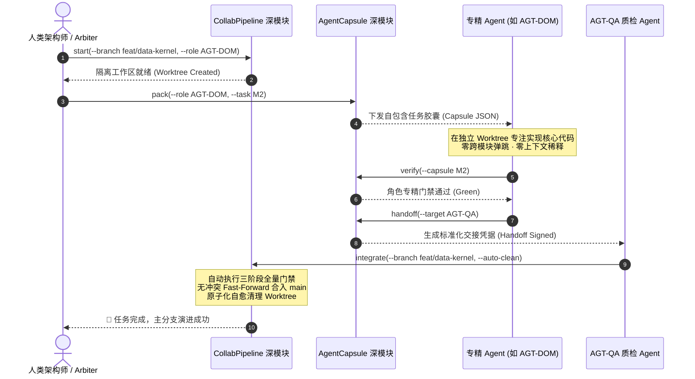

# 高效人机协同研发体系实施方案 (v1.0)
## —— 基于深任务胶囊 (AgentCapsule) 与事务型并行流水线 (CollabWorktree)

> **状态**：前期准备与协同框架演进方案基线  
> **设计目标**：构建“低摩擦、高杠杆、零上下文稀释”的多人类/多 Agent 并发协同研发脚手架  
> **核心哲学**：Deep Modules (深模块) · 极简接口 · 深度内聚 · 自动化门禁闭环  

---

## 1. 现状痛点与演进驱动 (Context & Motivation)

在 Phase 0 阶段，我们建立了初步的人机协同框架（HACF v1.0），包含 7 个专精 Agent 角色提示词（`.agents/prompts/`）、交接检查清单（`HANDOFF_CHECKLIST.md`）以及三阶段本地门禁（`scripts/gate_runner.sh`）。

然而，经过架构专家深度审计，当前协同体系存在典型的 **“浅接缝 (Shallow Seams)”** 痛点：
1. **人工横跳与上下文稀释 (Context Dilution)**：
   - 当任务在不同角色之间流转时（例如 Arbiter 派发给 Domain Agent，或 Domain Agent 提交给 QA Agent），依赖人类在 Git status、Markdown 规范文档、AST 图谱工具之间反复横跳与复制粘贴。
   - 极易导致 Agent 接收到过多冗余信息（Token 爆炸），或遗失关键不变量与前置约束，造成“上下文漂移”。
2. **并行开发的状态管理摩擦**：
   - 现有的 `worktree_manager.sh` 仅为 `git worktree add/remove` 的浅薄封装。
   - 多 Agent 在并行 Worktree 开发完成后，缺乏原子化的集成流水线，容易发生跨分支未跑门禁合并、脏状态污染或分支残留。

为此，本方案确立两大核心深模块：**`AgentCapsule` (深任务胶囊)** 与 **`CollabWorktree` (事务型并行流水线)**。

---

## 2. 模块一：`AgentCapsule` 深任务胶囊脚手架设计

### 2.1 核心理念：从“文档提示词”到“编译级任务胶囊”
`AgentCapsule` 是一个具有极高**杠杆率 (Leverage)** 与**局部性 (Locality)** 的工具深模块。其接口极其单一，接缝背后深度内聚了 Git 差异探测、代码知识图谱拓扑裁剪、环境探测与门禁绑定。

```text
┌────────────────────────────────────────────────────────┐
│             人类调度者 / Arbiter Agent                 │
└───────────────────────────┬────────────────────────────┘
                            │ CLI Interface:
                            │ rtk python3 scripts/agent_capsule.py pack --role AGT-DOM --task M2-DataKernel
                            ▼
┌────────────────────────────────────────────────────────┐
│               AgentCapsule 深模块接缝                  │
│  ┌──────────────────────────────────────────────────┐  │
│  │ 1. Git 状态探测: 提取当前分支差异与变更文件      │  │
│  │ 2. 图谱拓扑裁剪: codebase-memory-mcp AST 符号追踪 │  │
│  │ 3. 语义上下文装配: 注入该角色授权目录最小必要集  │  │
│  │ 4. 门禁契约绑定: 关联 Stage 1-3 专精自动化测试   │  │
│  └──────────────────────────────────────────────────┘  │
└───────────────────────────┬────────────────────────────┘
                            │ 生成自包含 JSON/Markdown 任务胶囊
                            ▼
┌────────────────────────────────────────────────────────┐
│           专精 Agent (如 AGT-DOM 领域 Agent)           │
│   无需全盘扫描无用文档 · 零 Token 浪费 · 零上下文稀释   │
└────────────────────────────────────────────────────────┘
```

### 2.2 CLI 接口设计 (The Interface)
对外仅暴露 3 个原子化命令：
```bash
# 1. 组装任务胶囊 (打包角色、上下文、代码图谱切片与目标)
rtk python3 scripts/agent_capsule.py pack \
    --role AGT-DOM \
    --task-id "M2-DATA-KERNEL" \
    --title "实现四库 SQLite 数据库迁移与连接池管理器" \
    --output ".agents/capsules/M2-DATA-KERNEL.json"

# 2. 验证当前工作区是否满足该胶囊的交付标准
rtk python3 scripts/agent_capsule.py verify \
    --capsule ".agents/capsules/M2-DATA-KERNEL.json"

# 3. 完成交接与归档 (生成 Handoff 记录并清理临时胶囊)
rtk python3 scripts/agent_capsule.py handoff \
    --capsule ".agents/capsules/M2-DATA-KERNEL.json" \
    --target-role AGT-QA
```

### 2.3 胶囊数据结构定义 (Capsule Schema)
任务胶囊为强类型自包含数据结构，定义如下：
```json
{
  "$schema": "contracts/schemas/task_capsule.schema.json",
  "capsule_id": "CAP-20260916-M2-001",
  "task_id": "M2-DATA-KERNEL",
  "title": "实现四库 SQLite 数据库迁移与连接池管理器",
  "assigned_role": "AGT-DOM",
  "created_at": "2026-09-16T16:40:00Z",
  "git_context": {
    "base_commit": "2749e70",
    "target_branch": "feat/m2-data-kernel",
    "dirty_files": []
  },
  "authorized_scope": {
    "directories": ["engine/domain/", "engine/infrastructure/database_manager.py", "engine/tests/"],
    "forbidden_patterns": ["macos-app/*", "contracts/schemas/*"]
  },
  "graph_slice": {
    "project": "Users-hrygo-Documents-WorldofMysteries",
    "symbols": [
      {"name": "DatabaseManagerProtocol", "file": "engine/infrastructure/database_manager.py", "in_degree": 2},
      {"name": "WorldEngineProtocol", "file": "engine/domain/world_engine.py", "in_degree": 6}
    ],
    "related_schemas": ["world_snapshot.schema.json", "state_delta.schema.json"]
  },
  "constraints": {
    "invariants": [1, 2, 10, 11],
    "rules": "严格禁止在 domain 层 import aiosqlite 或 sqlite3；严格保持 canon.db 只读"
  },
  "verification_commands": [
    "rtk python3 scripts/check_architecture_fitness.py",
    "rtk uv run pytest engine/tests/ -k 'database or domain'"
  ]
}
```

### 2.4 图谱自动裁剪机制 (Graph Slicing Engine)
`AgentCapsule` 调用 `codebase-memory-mcp` 的核心逻辑：
1. **授权目录符号筛选**：查询属于 `authorized_scope.directories` 内的全部核心类与函数。
2. **依赖调用链追踪**：调用 `trace_path(symbol, direction='both', depth=2)`，仅捕获该角色直接相关的上游与下游节点。
3. **Token 瘦身**：将庞大的数万行全局代码库压缩为 **< 500 Token 的局部精确调用子图**，彻底防止大模型幻觉与越界修改。

---

## 3. 模块二：`CollabWorktree` 事务型并行流水线设计

### 3.1 核心理念：将 Git Worktree 提升为“原子事务接缝”
传统基于 shell 脚本的手工 worktree 操作极易在以下环节发生断裂：
- Agent 忘记在 worktree 中安装依赖或拉取最新主分支；
- Agent 在未通过完整门禁的情况下强行合入代码；
- 分支合并后本地残留废弃的 worktree 目录，导致磁盘浪费与名称冲突。

`CollabWorktree` 将分支研发视为一次 **ACID 事务**：

```text
┌────────────────────────────────────────────────────────┐
│                   CollabWorktree Pipeline              │
├────────────────────────────────────────────────────────┤
│ 1. BEGIN TRANSACTION:                                  │
│    - 自动拉取 main 最新提交                            │
│    - 自动创建隔离目录 ../wom-worktrees/<branch>         │
│    - 自动软链接 .venv 与项目环境                       │
├────────────────────────────────────────────────────────┤
│ 2. AGENT EXECUTION:                                    │
│    - 专精 Agent 在完全独立的目录无锁编码               │
│    - 与其他 Agent 互不影响，零文件锁冲突               │
├────────────────────────────────────────────────────────┤
│ 3. COMMIT & VERIFY (门禁前置验证):                     │
│    - 运行 Stage 1: 架构适应度 AST 检查                 │
│    - 运行 Stage 2: Python 全量契约与单测 (pytest)      │
│    - 运行 Stage 3: Swift 6 跨语言与并发测试 (swift test)│
├────────────────────────────────────────────────────────┤
│ 4. INTEGRATE & TEARDOWN (原子合流与自愈清理):          │
│    - 无冲突时 Fast-Forward 合入 main                   │
│    - 自动删除该 Worktree 目录并清理分支                │
│    - 若门禁失败：ROLLBACK (终止合并，保留环境供调试)   │
└────────────────────────────────────────────────────────┘
```

### 3.2 CLI 接口设计 (The Interface)
```bash
# 开启事务：为特定任务与角色创建独立并行工作区
rtk python3 scripts/collab_pipeline.py start \
    --branch feat/m2-data-kernel \
    --role AGT-DOM

# 提交事务：跑批门禁、原子合并入 main、清理工作区
rtk python3 scripts/collab_pipeline.py integrate \
    --branch feat/m2-data-kernel \
    --auto-clean

# 异常回滚或主动放弃：安全清理工作区
rtk python3 scripts/collab_pipeline.py abort \
    --branch feat/m2-data-kernel
```

---

## 4. 人机与多 Agent 协同闭环演练流程 (Operational Flow)

结合两大深模块，未来全流程人机协作的标准作业程序（SOP）如下：



---

## 5. 实施落地计划 (Implementation Roadmap)

本方案作为系统前期搭建的高效脚手架，将分两步落地：

### 第一步：契约与脚手架代码固化 (Pre-Phase 1)
1. **Schema 定义**：新增 `contracts/schemas/task_capsule.schema.json`，将任务胶囊结构标准化；
2. **脚本实现**：
   - 编写 `scripts/agent_capsule.py`（基于 `codebase-memory-mcp` 的图谱切片与打包）；
   - 编写 `scripts/collab_pipeline.py`（基于 Git Worktree 的事务型流水线）；
3. **门禁集成**：将 `agent_capsule verify` 接入现有 `scripts/gate_runner.sh`。

### 第二步：实战检验与首个里程碑应用 (Phase 1 / M1 & M2)
- 在启动 **M1（本地引擎环境与部署拓扑）** 与 **M2（SQLite 多模型数据内核）** 时，全量采用 `CollabPipeline` 与 `AgentCapsule` 进行人机协同研发，验证零冲突、零稀释效果。
