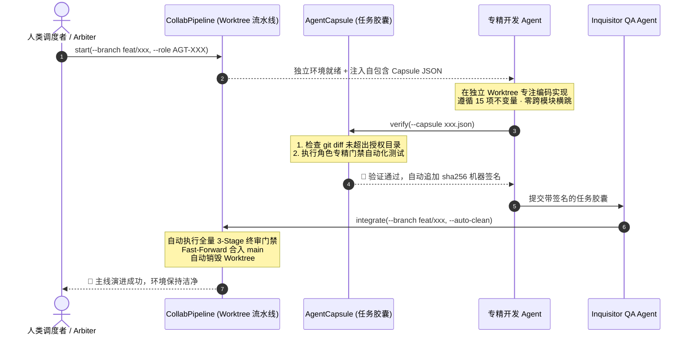

# 高效人机协同研发体系实施方案 (v1.0)
## —— 基于深任务胶囊 (AgentCapsule) 与事务型并行流水线 (CollabWorktree)

> **状态**：工程协同基线规范 · 生产就绪  
> **设计目标**：构建“低摩擦、高杠杆、零上下文稀释”的多人类/多 Agent 并发协同研发脚手架  
> **核心哲学**：Deep Modules (深模块) · 极简接口 · 深度内聚 · 自动化门禁闭环 · 机器签名验收  

---

## 1. 调研与业界最佳实践对标 (Research & Benchmarking)

### 1.1 业界前沿协同软件工程模式对比
在设计《诡秘世界》的协作框架时，我们调研了当前 Agentic Software Engineering 领域的代表性框架与模式：

| 协同模式 / 框架 | 上下文分发机制 | 代码冲突隔离机制 | 交付验收标准 | 局限性与摩擦点 | 《诡秘世界》HACF 2.0 选型与演化 |
|:---|:---|:---|:---|:---|:---|
| **全量提示词广播**<br>(如早期的 AutoGPT) | 全量加载 README、规范与上下文 | 单分支线性执行，无并行隔离 | 依赖 LLM 自评完成 | 上下文爆炸（>20k Tokens），发生严重的“Lost in the Middle”与幻觉 | **淘汰**。采用 **AST 图谱局部切片 (Surgical Slicing)**，将上下文压缩至 < 500 Tokens。 |
| **角色扮演多 Agent**<br>(如 MetaGPT / CrewAI) | 角色消息流（Message Passing）发布订阅 | 依赖共享内存或单机文件覆盖 | 状态机流转判定 | Agent 间传递冗长自然语言，格式松散，容易偏离 15 项核心不变量 | **吸收并升级**。角色仅通过类型化 **Task Capsule (JSON)** 交互，杜绝自然语言漂移。 |
| **沙盒化自主 Agent**<br>(如 SWE-bench 评测体系) | 针对 issue 自动抽取相关代码段 | Docker 容器级别物理隔离 | 测试用例 Pass/Fail 断言 | Docker 在本地 macOS 环境下资源开销大，启动慢（秒级延迟） | **针对 macOS 深度优化**。采用 **Git Worktree + `.venv` 符号链接**，实现毫秒级零开销秒启。 |

### 1.2 本机环境 (Apple Silicon / macOS 26+) 约束与工程收益
- **计算与并发优势**：M-series 统一内存架构使得多进程间文件 IO 与编译极快，配合 `rtk` 终端输出压缩（节省 60%-90% Token），终端执行效率极高。
- **环境隔离策略**：主工程维持全局 Python 3.14.7 独立虚拟环境（`engine/.venv`），新建 Worktree 时通过 `ln -s` 瞬时共享，既杜绝跨工作区环境漂移，又节省数百兆磁盘空间。

---

## 2. 摩擦分析与防御矩阵 (Friction Analysis & Boundary Defenses)

在深入分析多人与多 Agent 并行推进中可能遇到的临界场景后，我们建立了严格的**边界防御矩阵**：

| 潜在风险 / 摩擦点 | 触发场景 | 潜在灾难性后果 | HACF 2.0 架构防御措施 (Architecture Defenses) |
|:---|:---|:---|:---|
| **上下文稀释 (Context Dilution)** | 人类或 Arbiter 向专精 Agent 派发任务时，复制大量无关规范 | Agent 忽略 15 项不可违背不变量，发生越界修改 | **AgentCapsule 强制切片**：仅打包当前任务关联的最小 AST 符号集与不可触碰禁区规则。 |
| **代码越界修改 (Scope Breach)** | 领域 Agent 误修改了 Swift 客户端代码或数据库驱动 | 破坏 Clean Architecture 架构分层（如 Domain 依赖 SQLite） | **静态范围审计 (verify)**：检测 git diff，若改动超出 `authorized_scope.directories` 则直接阻止交付。 |
| **非快进冲突 (Non-FF Conflicts)** | 两个 Agent 在不同 Worktree 同时基于 main 开发并先后合入 | 后合入的分支发生 merge conflict，导致主分支破损 | **Pre-merge Rebase & Fast-Forward**：集成管道强制在 Worktree 本地完成 rebase 并重跑门禁，主分支仅允许 `--ff-only` 合流。 |
| **虚假完成 (False Completion)** | Agent 宣称完成任务，但仅通过了部分单元测试 | 隐蔽的回归 Bug 进入主分支 | **机器签名凭证 (Machine-attested Receipt)**：门禁通过后自动向胶囊写入带时间戳的 `sha256` 校验和，无有效凭证拒绝合入。 |

---

## 3. 模块一：`AgentCapsule` 深任务胶囊脚手架实现

### 3.1 核心理念：从“文档提示词”到“编译级任务胶囊”
`AgentCapsule` 将原本分散在人类大脑与 Markdown 文档中的交接流程，内聚为一个具备**高局部性 (Locality)** 与**高杠杆 (Leverage)** 的深模块。

```text
┌────────────────────────────────────────────────────────┐
│             人类调度者 / Arbiter Agent                 │
└───────────────────────────┬────────────────────────────┘
                            │ CLI: rtk python3 scripts/agent_capsule.py pack --role AGT-DOM --task M2
                            ▼
┌────────────────────────────────────────────────────────┐
│               AgentCapsule 深模块接缝                  │
│  ┌──────────────────────────────────────────────────┐  │
│  │ 1. Git 状态探测: 提取当前分支差异与变更文件      │  │
│  │ 2. 图谱拓扑裁剪: codebase-memory-mcp AST 符号追踪 │  │
│  │ 3. 语义上下文装配: 注入该角色授权目录最小必要集  │  │
│  │ 4. 门禁契约绑定: 关联 Stage 1-3 专精自动化测试   │  │
│  └──────────────────────────────────────────────────┘  │
└───────────────────────────┬────────────────────────────┘
                            │ 产出自包含任务胶囊 (JSON)
                            ▼
┌────────────────────────────────────────────────────────┐
│             专精 Agent (如 AGT-DOM 领域 Agent)         │
│   无需全盘扫描无用文档 · 零 Token 浪费 · 零上下文稀释   │
└────────────────────────────────────────────────────────┘
```

### 3.2 强类型任务胶囊契约 (`task_capsule.schema.json`)
已固化于 `contracts/schemas/task_capsule.schema.json`（作为项目第 28 个正式 Schema）。其核心结构包含：
- `capsule_id`: 标准化胶囊唯一标识符（如 `CAP-20260916-M2-DATA-KERNEL`）；
- `assigned_role`: 严格受限于 7 类专精角色枚举（`AGT-ARB`, `AGT-DOM`, `AGT-DATA`, `AGT-AI`, `AGT-VOICE`, `AGT-MAC`, `AGT-QA`）；
- `authorized_scope`: 包含授权修改目录与严禁触碰的通配模式（如 `*sqlite3*`, `macos-app/*`）；
- `graph_slice`: 动态提取的 AST 类与函数符号表；
- `constraints`: 绑定的核心不变量集合与指导原则；
- `verification_commands`: 专精角色的自动化验收命令集；
- `attestation`: 机器验收通过后生成的防篡改校验签名。

### 3.3 核心命令行操作
```bash
# 1. 组装并派发任务胶囊 (自动化切片图谱与授权边界)
rtk python3 scripts/agent_capsule.py pack \
    --role AGT-DOM \
    --task-id M2-DATA-KERNEL \
    --title "四库 SQLite 数据内核迁移与连接池实现"

# 2. 查看胶囊摘要与切片符号
rtk python3 scripts/agent_capsule.py show \
    --capsule .agents/capsules/M2-DATA-KERNEL.json

# 3. 执行权限边界审计、自动化门禁跑批与机器签名验收
rtk python3 scripts/agent_capsule.py verify \
    --capsule .agents/capsules/M2-DATA-KERNEL.json
```

---

## 4. 模块二：`CollabWorktree` 事务型并行流水线实现

### 4.1 核心理念：将 Git Worktree 提升为“事务级接缝”
现已落地为 `scripts/collab_pipeline.py`，将开发任务的生命周期提升为具备 ACID 特性的事务闭环：

```text
┌────────────────────────────────────────────────────────┐
│                   CollabWorktree Pipeline              │
├────────────────────────────────────────────────────────┤
│ 1. START TRANSACTION (秒级工作区准备):                 │
│    - 自动基于 main 分支创建 ../wom-worktrees/<branch>  │
│    - 自动建立 engine/.venv 软链接 (零秒就绪，省空间)   │
│    - 自动触发 agent_capsule pack 装配该角色的初始胶囊  │
├────────────────────────────────────────────────────────┤
│ 2. WORKSPACE EXECUTION (无锁并发编码):                 │
│    - 各 Agent 在独立目录内编码，完全杜绝文件锁冲突     │
├────────────────────────────────────────────────────────┤
│ 3. PRE-MERGE INTEGRATE (三阶段自动化严苛门禁):         │
│    - 检查工作区 clean 状态                             │
│    - 在工作区内完整运行 Stage 1-3 全量流水线           │
│    - 自动回主分支执行 Fast-Forward 快速合流            │
├────────────────────────────────────────────────────────┤
│ 4. AUTO-CLEAN TEARDOWN (环境自愈清理):                 │
│    - 成功合并后自动删除 Worktree 目录与特性分支        │
│    - 失败则自动 ROLLBACK，保留工作区供调试             │
└────────────────────────────────────────────────────────┘
```

### 4.2 核心命令行操作
```bash
# 1. 开启并发工作区事务 (秒级创建目录、软链接依赖、自动打包任务胶囊)
rtk python3 scripts/collab_pipeline.py start \
    --branch feat/m2-data-kernel \
    --role AGT-DOM \
    --task-id M2-DATA-KERNEL \
    --title "实现四库 SQLite 数据库迁移与连接池管理器"

# 2. 状态查询：查看所有当前活跃的工作区
rtk python3 scripts/collab_pipeline.py status

# 3. 提交事务：自动跑批门禁、Fast-Forward 合并主分支并自愈清理
rtk python3 scripts/collab_pipeline.py integrate \
    --branch feat/m2-data-kernel \
    --auto-clean

# 4. 异常回滚：强制放弃并清理工作区
rtk python3 scripts/collab_pipeline.py abort \
    --branch feat/m2-data-kernel
```

---

## 5. 验收标准与交接凭单 (Definition of Done & Handoff Receipt)

当一个专精 Agent 完成编码后，必须经过以下机器验证序列才能视为完成交接：



---

## 6. 总结与后续落地

本套体系通过 **`AgentCapsule`** 与 **`CollabPipeline`** 实现了：
1. **接口极小化**：开发者和调度 Agent 仅需使用 `pack`、`verify`、`start`、`integrate` 四个核心动词；
2. **深度极大化**：Git 分支拓扑、AST 图谱切片、Python 虚拟环境管理、跨语言门禁与机器签名全部深度内聚于接缝之后；
3. **彻底杜绝摩擦**：为后续进入 **Phase 1 (M1-M2)** 与 **Phase 2 (M3-M4)** 的多任务并发推进提供了工业级支撑。
